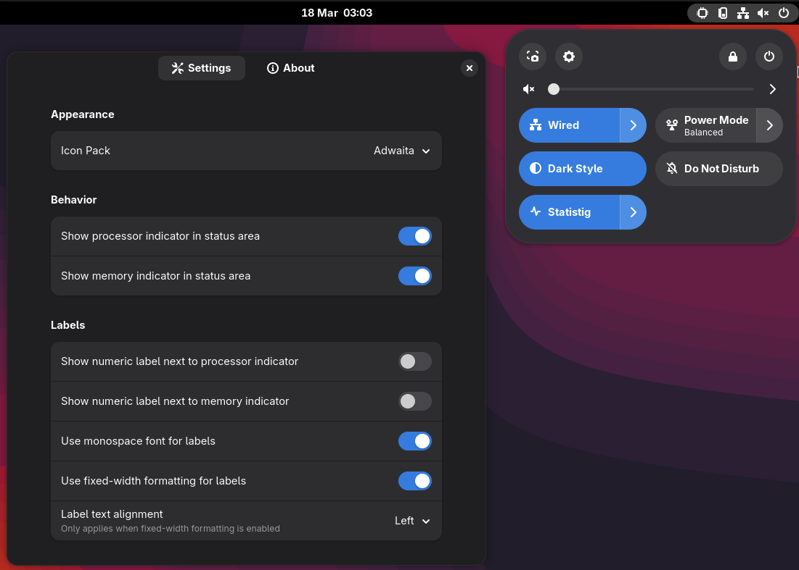
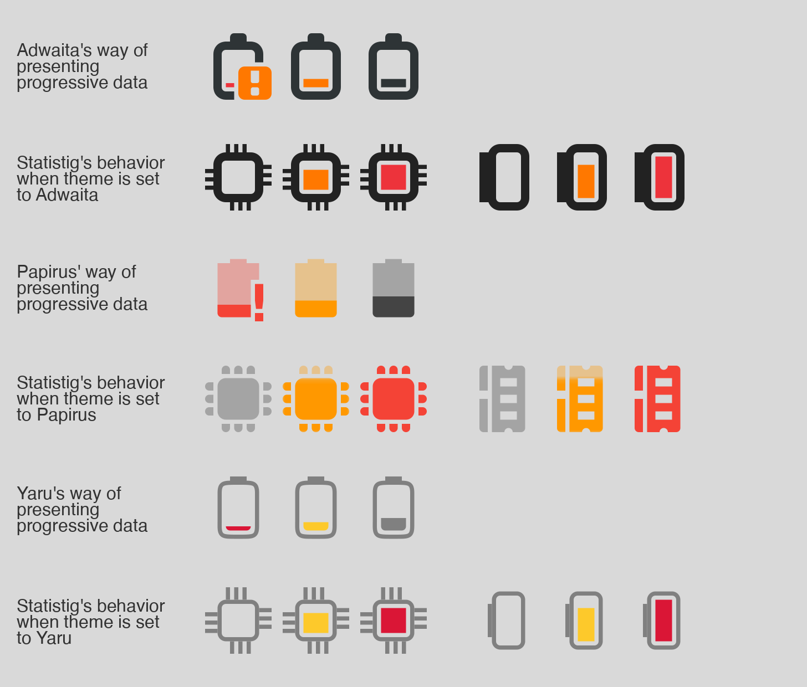

# Statistig

Statistig is a minimal and elegant system monitor for GNOME Shell, designed to align with GNOME’s UX guidelines. It displays real-time CPU and memory usage directly in the system status area, alongside core indicators like battery, volume, and network — without cluttering the top bar. For a more capable monitoring solution, visit [TopHat](https://github.com/fflewddur/tophat) extension's GitHub page.

  

Statistig respects the UI. Below are some of icons, to explain how decisions are made when crafting icons. Since the area these icons are going to be displayed is too small, communication through colors is preferred. Either indicators will turn to yellow to indicate 70% to 89%, and red to indicate the rest. Three icon packs are available (Adwaita, Papirus and Yaru); pick one in the extension's preferences.

  

# Installation

Install Statistig from the [GNOME Shell Extensions page](https://extensions.gnome.org/extension/8071/statistig/)

## Requirements

* GNOME 50 or 51. (Version 5 on extensions.gnome.org supports GNOME 48, 49 and 50.)

## Compatibility

Statistig has been tested on the following systems

* Fedora 42, 43, 44

## Manual Installation

### Install a compiled version

* Download the zip file listed under the latest tag in the [releases tab](https://github.com/mustafaaycll/statistig/releases)
* Install it with `gnome-extensions install --force statistig@mustafaaycll.github.io.shell-extension.zip`
* Log out and log back in so GNOME Shell picks it up.
* Enable it with `gnome-extensions enable statistig@mustafaaycll.github.io` (or from the Extensions app).

### Compile it yourself

Building needs Node.js and npm, plus gettext (`msgfmt`) to include translations. The build runs on Linux and macOS; installing needs a GNOME session.

* Clone the repository using `git clone https://github.com/mustafaaycll/statistig.git`
* Go to the containing directory using `cd statistig`
* Run `npm install` to fetch dependencies
* Run *one* of the steps below:
  * Run `npm run build` to compile the extension in zip format (`statistig@mustafaaycll.github.io.shell-extension.zip` in the repository root), then install it as described above
  * OR run `npm run build:install` to compile and install it on your GNOME Shell
* Log out and log back in so GNOME Shell picks it up.
* Enable it with `gnome-extensions enable statistig@mustafaaycll.github.io` (or from the Extensions app).

## Development

* `npm run check:types` type checks the code; `npm run check:format` checks formatting (`npm run format` fixes it).
* `npm run translations:update` regenerates `po/statistig.pot` and updates the translations after changing user-visible strings.
* To try a build without logging out, run `npm run build:dev` and start a nested GNOME Shell with `dbus-run-session gnome-shell --devkit --wayland` (GNOME 49 and newer) or `dbus-run-session gnome-shell --nested --wayland` (GNOME 48). See the [GJS guide](https://gjs.guide/extensions/development/debugging.html).

# License

Statistig is distributed under the terms of the GNU General Public License,
version 3 or later. See the [license](LICENSE) file for details.

## Credits

Statistig is developed by [Mustafa Yücel](https://github.com/mustafaaycll) as a streamlined alternative to [TopHat](https://github.com/fflewddur/tophat), with a focus on simplicity, visual clarity, and seamless integration with GNOME Shell.

This is my first GNOME extension, and I’d like to thank [Todd Kulesza](https://github.com/fflewddur) and [Jean-Philippe Braun](https://github.com/eonpatapon), whose work and codebases greatly helped me understand the structure of well-designed GNOME extensions.

The Adwaita icons located in `resources/icons` and `src/icons` are either used as-is or are derivative works based on assets from the [GNOME Project](https://gitlab.gnome.org/GNOME/adwaita-icon-theme). They are licensed under the [Creative Commons Attribution-ShareAlike 3.0 Unported License](http://creativecommons.org/licenses/by-sa/3.0/).

The Papirus icons located in `resources/icons` and `src/icons` are either used as-is or are derivative works based on assets from the [Papirus Icon Theme](https://github.com/PapirusDevelopmentTeam/papirus-icon-theme). They are licensed under the [GNU General Public License v3.0](https://www.gnu.org/licenses/gpl-3.0.html).

The Yaru icons located in `resources/icons` and `src/icons` are either used as-is or are derivative works based on assets from the [Yaru Icon Theme](https://github.com/ubuntu/yaru). They are licensed under the [Creative Commons Attribution-ShareAlike 4.0 International License](https://creativecommons.org/licenses/by-sa/4.0/).
