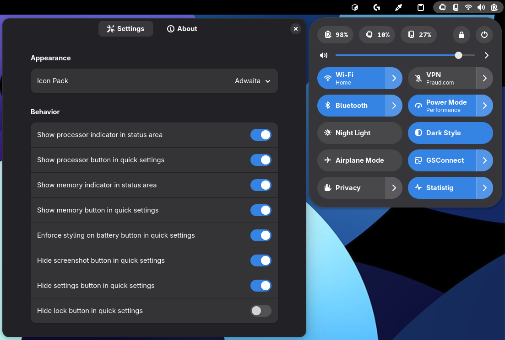

# Statistig

Statistig is a minimal and elegant system monitor for GNOME Shell, designed to align with GNOME’s UX guidelines. It displays real-time CPU and memory usage directly in the system status area, alongside core indicators like battery, volume, and network — without cluttering the top bar. For a more capable monitoring solution, visit [TopHat](https://github.com/fflewddur/tophat) extension's GitHub page.

  

# Installation

Install Statistig from the (link will be available as soon as it is released on GNOME Shell extensions page)

## Requirements

* Gnome 46 or newer.

## Compatibility

Statistig has been tested on the following systems

* Fedora 41, 42

## Manual Installation

* Clone the repository using `git clone <url>`
* Go to the containing directory using `cd statistig`
* Run `npm install` to fetch dependencies
* Run `chmod +x scripts/build.sh` with sudo privileges to make `build.sh` script executable.
* Run `./scripts/build.sh` to install it on you GNOME Shell
* Log out and log in back to enable it.

# License

Statistig is distributed under the terms of the GNU General Public License,
version 3 or later. See the [license](LICENSE) file for details.

## Credits

Statistig is developed by [Mustafa Yücel](https://github.com/mustafaaycll) as a streamlined alternative to [TopHat](https://github.com/fflewddur/tophat), with a focus on simplicity, visual clarity, and seamless integration with GNOME Shell.

This is my first GNOME extension, and I’d like to thank [Todd Kulesza](https://github.com/fflewddur) and [Jean-Philippe Braun](https://github.com/eonpatapon), whose work and codebases greatly helped me understand the structure of well-designed GNOME extensions.

The Adwaita icons located in `resources/icons` are either used as-is or are derivative works based on assets from the [GNOME Project](https://gitlab.gnome.org/GNOME/adwaita-icon-theme). They are licensed under the [Creative Commons Attribution-ShareAlike 3.0 Unported License](http://creativecommons.org/licenses/by-sa/3.0/).

The Papirus icons located in `resources/icons` are either used as-is or are derivative works based on assets from the [Papirus Icon Theme](https://github.com/PapirusDevelopmentTeam/papirus-icon-theme). They are licensed under the [GNU General Public License v3.0](https://www.gnu.org/licenses/gpl-3.0.html).

